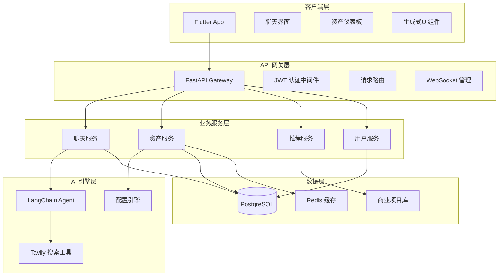
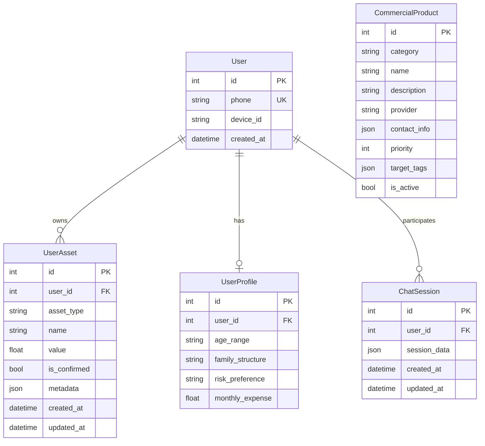
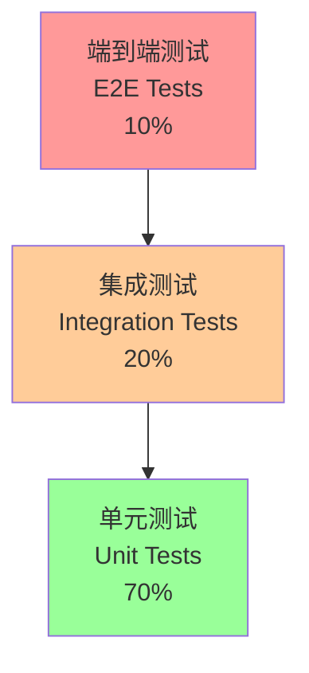

# 设计文档

## 概述

AssetFlow 是一个基于 AI 的家庭资产配置顾问系统，采用微服务架构，前端使用 Flutter，后端使用 FastAPI + LangChain。系统通过对话式 AI 引导用户完成资产盘点，基于标准普尔四象限模型提供个性化的资产配置建议。

核心设计理念：
- **AI 原生**: 以对话为主要交互方式，降低用户使用门槛
- **数据驱动**: 通过实时搜索和用户画像提供精准建议
- **安全第一**: 严格的身份验证和数据隔离机制
- **商业闭环**: 结构化推荐系统支持商业化变现

## 架构

### 系统架构图



### 技术栈选择

**前端 (Flutter)**
- **状态管理**: Riverpod - 提供类型安全的响应式状态管理
- **路由**: GoRouter - 声明式路由，支持深链接
- **图表**: fl_chart - 原生 Flutter 图表库，性能优秀
- **WebSocket**: web_socket_channel - 实时通信支持

**后端 (Python)**
- **包管理**: UV - 现代化 Python 包管理器，比 pip 更快更可靠
- **Web 框架**: FastAPI - 高性能异步框架，自动 API 文档
- **AI 编排**: LangChain - 成熟的 AI Agent 框架
- **数据库**: PostgreSQL + SQLModel - 关系型数据库，类型安全 ORM
- **缓存**: Redis - 高性能缓存，支持会话存储
- **搜索**: Tavily API - 专为 AI 优化的搜索服务
- **代码质量**: Ruff - 极速 Python 代码格式化和检查工具

**开发工具**:
- **容器化**: Docker + Docker Compose
- **代码质量**: Ruff (格式化 + 检查)
- **测试**: pytest + Hypothesis (后端), Flutter Test (前端)
- **API文档**: FastAPI 自动生成 OpenAPI

## 组件和接口

### 核心组件

#### 1. 聊天代理 (ChatAgent)

```python
class ChatAgent:
    def __init__(self, llm_model: str, tools: List[Tool]):
        self.llm = ChatOpenAI(model=llm_model)
        self.tools = tools
        self.agent = create_openai_functions_agent(self.llm, tools)
    
    async def process_message(self, message: str, user_context: UserContext) -> AsyncIterator[str]:
        """处理用户消息并返回流式响应"""
        pass
    
    def extract_ui_components(self, response: str) -> List[UIComponent]:
        """从响应中提取UI组件标签"""
        pass
```

**职责**:
- 处理用户自然语言输入
- 调用搜索工具获取房产信息
- 生成结构化响应和UI组件标签
- 维护对话上下文和状态

#### 2. 搜索工具 (PropertySearchTool)

```python
class PropertySearchTool(BaseTool):
    name = "property_search"
    description = "搜索房产市场价格信息"
    
    def _run(self, city: str, community: str, area: float) -> Dict:
        """执行房产搜索"""
        query = f"{city} {community} 二手房 挂牌均价 {datetime.now().strftime('%Y年%m月')}"
        results = self.tavily_client.search(query)
        return self._extract_price_info(results)
    
    def _extract_price_info(self, results: Dict) -> Dict:
        """从搜索结果中提取价格信息"""
        pass
```

**职责**:
- 构造房产搜索查询
- 调用 Tavily API 获取实时数据
- 解析搜索结果提取价格信息
- 应用保守估算因子

#### 3. 配置引擎 (AllocationEngine)

```python
class AllocationEngine:
    def calculate_portfolio_health(self, assets: List[UserAsset], user_profile: UserProfile) -> PortfolioHealth:
        """计算投资组合健康度"""
        net_worth = self._calculate_net_worth(assets)
        real_estate_ratio = self._calculate_real_estate_ratio(assets, net_worth)
        liquidity_ratio = self._calculate_liquidity_ratio(assets, user_profile)
        
        return PortfolioHealth(
            net_worth=net_worth,
            real_estate_ratio=real_estate_ratio,
            liquidity_ratio=liquidity_ratio,
            risk_warnings=self._generate_warnings(real_estate_ratio, liquidity_ratio, assets)
        )
    
    def _generate_warnings(self, re_ratio: float, liq_ratio: float, assets: List[UserAsset]) -> List[RiskWarning]:
        """生成风险警告"""
        pass
```

**职责**:
- 实现标准普尔四象限计算逻辑
- 根据用户画像调整风险阈值
- 生成个性化风险警告
- 计算资产配置建议

#### 4. 推荐服务 (RecommendationService)

```python
class RecommendationService:
    def get_recommendations(self, portfolio_health: PortfolioHealth, user_profile: UserProfile) -> List[ActionCard]:
        """根据投资组合健康度生成推荐"""
        recommendations = []
        
        for warning in portfolio_health.risk_warnings:
            matching_products = self._query_commercial_database(warning.category, user_profile)
            recommendations.extend(self._create_action_cards(matching_products))
        
        return self._prioritize_recommendations(recommendations)
    
    def _query_commercial_database(self, category: str, profile: UserProfile) -> List[CommercialProduct]:
        """从商业项目数据库查询匹配产品"""
        pass
```

**职责**:
- 根据风险警告匹配商业产品
- 按优先级排序推荐内容
- 生成结构化行动卡片
- 跟踪用户交互数据

### API 接口设计

#### WebSocket 聊天接口

```python
@app.websocket("/ws/chat/{user_id}")
async def websocket_chat(websocket: WebSocket, user_id: int, token: str = Query(...)):
    """WebSocket 聊天连接"""
    user = await authenticate_websocket(token)
    if user.id != user_id:
        await websocket.close(code=1008)
        return
    
    await websocket.accept()
    
    try:
        while True:
            message = await websocket.receive_text()
            async for response_chunk in chat_agent.process_message(message, user):
                await websocket.send_text(response_chunk)
    except WebSocketDisconnect:
        pass
```

#### REST API 接口

```python
# 资产管理
@app.get("/api/assets/{user_id}")
async def get_user_assets(user_id: int, current_user: User = Depends(get_current_user)):
    """获取用户资产列表"""
    if current_user.id != user_id:
        raise HTTPException(status_code=403)
    return await asset_service.get_assets(user_id)

@app.post("/api/assets/{user_id}")
async def create_asset(user_id: int, asset: AssetCreate, current_user: User = Depends(get_current_user)):
    """创建新资产"""
    if current_user.id != user_id:
        raise HTTPException(status_code=403)
    return await asset_service.create_asset(user_id, asset)

# 投资组合分析
@app.get("/api/portfolio/{user_id}/health")
async def get_portfolio_health(user_id: int, current_user: User = Depends(get_current_user)):
    """获取投资组合健康度分析"""
    if current_user.id != user_id:
        raise HTTPException(status_code=403)
    return await allocation_engine.analyze_portfolio(user_id)
```

## 数据模型

### 核心数据模型

```python
from enum import Enum
from typing import Optional, List
from sqlmodel import SQLModel, Field, Relationship
from datetime import datetime

class AssetType(str, Enum):
    REAL_ESTATE = "real_estate"  # 房产
    CASH = "cash"               # 现金
    INVESTMENT = "investment"   # 投资
    INSURANCE = "insurance"     # 保险
    LIABILITY = "liability"     # 负债

class RiskLevel(str, Enum):
    CONSERVATIVE = "conservative"  # 保守型
    MODERATE = "moderate"         # 稳健型
    AGGRESSIVE = "aggressive"     # 激进型

class User(SQLModel, table=True):
    id: Optional[int] = Field(default=None, primary_key=True)
    phone: str = Field(unique=True, index=True)
    device_id: Optional[str] = Field(default=None, index=True)
    created_at: datetime = Field(default_factory=datetime.utcnow)
    
    # 关联关系
    assets: List["UserAsset"] = Relationship(back_populates="user")
    profile: Optional["UserProfile"] = Relationship(back_populates="user")

class UserProfile(SQLModel, table=True):
    id: Optional[int] = Field(default=None, primary_key=True)
    user_id: int = Field(foreign_key="user.id", unique=True)
    age_range: str  # "30-40", "40-50", etc.
    family_structure: str  # "single", "married", "married_with_kids"
    risk_preference: RiskLevel
    monthly_expense: Optional[float] = None
    
    # 关联关系
    user: User = Relationship(back_populates="profile")

class UserAsset(SQLModel, table=True):
    id: Optional[int] = Field(default=None, primary_key=True)
    user_id: int = Field(foreign_key="user.id", index=True)
    asset_type: AssetType
    name: str  # 资产名称，如"天通苑北一区"
    value: float  # 资产价值
    is_confirmed: bool = False  # 是否经用户确认
    metadata: Optional[dict] = Field(default=None)  # 额外信息，如面积、位置等
    created_at: datetime = Field(default_factory=datetime.utcnow)
    updated_at: datetime = Field(default_factory=datetime.utcnow)
    
    # 关联关系
    user: User = Relationship(back_populates="assets")

class CommercialProduct(SQLModel, table=True):
    id: Optional[int] = Field(default=None, primary_key=True)
    category: str  # "insurance", "broker", "investment"
    name: str
    description: str
    provider: str
    contact_info: dict  # 联系方式
    priority: int = Field(default=0)  # 推荐优先级
    target_tags: List[str] = Field(default=[])  # 目标用户标签
    is_active: bool = True
    
class ChatSession(SQLModel, table=True):
    id: Optional[int] = Field(default=None, primary_key=True)
    user_id: int = Field(foreign_key="user.id", index=True)
    session_data: dict  # 存储对话上下文
    created_at: datetime = Field(default_factory=datetime.utcnow)
    updated_at: datetime = Field(default_factory=datetime.utcnow)
```

### 数据关系设计



## 错误处理

### 错误分类和处理策略

#### 1. 业务逻辑错误

```python
class AssetFlowException(Exception):
    """业务异常基类"""
    def __init__(self, message: str, error_code: str):
        self.message = message
        self.error_code = error_code
        super().__init__(message)

class PropertySearchException(AssetFlowException):
    """房产搜索异常"""
    pass

class AuthenticationException(AssetFlowException):
    """认证异常"""
    pass

class DataValidationException(AssetFlowException):
    """数据验证异常"""
    pass
```

#### 2. 外部服务错误

**Tavily API 错误处理**:
```python
async def search_property_with_fallback(city: str, community: str) -> PropertySearchResult:
    try:
        result = await tavily_client.search(f"{city} {community} 二手房价格")
        if not result.results:
            return PropertySearchResult(success=False, fallback_to_manual=True)
        return PropertySearchResult(success=True, data=result)
    except TavilyAPIException as e:
        logger.error(f"Tavily API 错误: {e}")
        return PropertySearchResult(success=False, fallback_to_manual=True, error=str(e))
    except asyncio.TimeoutError:
        logger.error("Tavily API 超时")
        return PropertySearchResult(success=False, fallback_to_manual=True, error="搜索超时")
```

#### 3. 数据库错误

```python
@retry(stop=stop_after_attempt(3), wait=wait_exponential(multiplier=1, min=4, max=10))
async def save_user_asset(asset: UserAsset) -> UserAsset:
    try:
        async with get_db_session() as session:
            session.add(asset)
            await session.commit()
            await session.refresh(asset)
            return asset
    except IntegrityError as e:
        logger.error(f"数据完整性错误: {e}")
        raise DataValidationException("资产数据保存失败", "ASSET_SAVE_ERROR")
    except Exception as e:
        logger.error(f"数据库错误: {e}")
        raise AssetFlowException("系统暂时不可用", "DATABASE_ERROR")
```

#### 4. 前端错误处理

```dart
class ErrorHandler {
  static void handleApiError(DioError error) {
    switch (error.response?.statusCode) {
      case 401:
        // 跳转到登录页面
        Get.offAllNamed('/login');
        break;
      case 403:
        showErrorSnackbar('访问被拒绝');
        break;
      case 500:
        showErrorSnackbar('服务器内部错误，请稍后重试');
        break;
      default:
        showErrorSnackbar('网络错误，请检查网络连接');
    }
  }
  
  static void handleWebSocketError(dynamic error) {
    logger.error('WebSocket 连接错误: $error');
    // 尝试重连
    chatService.reconnect();
  }
}
```

## 测试策略

### 测试金字塔



### 单元测试策略

**后端单元测试 (pytest)**:
```python
class TestAllocationEngine:
    def test_calculate_net_worth(self):
        """测试净资产计算"""
        assets = [
            UserAsset(asset_type=AssetType.REAL_ESTATE, value=5000000),
            UserAsset(asset_type=AssetType.CASH, value=500000),
            UserAsset(asset_type=AssetType.LIABILITY, value=2000000)
        ]
        engine = AllocationEngine()
        net_worth = engine._calculate_net_worth(assets)
        assert net_worth == 3500000
    
    def test_risk_warning_generation(self):
        """测试风险警告生成"""
        engine = AllocationEngine()
        warnings = engine._generate_warnings(
            real_estate_ratio=0.85,
            liquidity_ratio=2.0,
            assets=[]
        )
        assert len(warnings) == 2  # 房产集中度 + 流动性风险
        assert any(w.type == "HIGH_RE_CONCENTRATION" for w in warnings)
        assert any(w.type == "LIQUIDITY_CRISIS" for w in warnings)
```

**前端单元测试 (Flutter Test)**:
```dart
void main() {
  group('AssetCalculator Tests', () {
    test('should calculate correct asset distribution', () {
      final assets = [
        Asset(type: AssetType.realEstate, value: 5000000),
        Asset(type: AssetType.cash, value: 500000),
      ];
      
      final calculator = AssetCalculator();
      final distribution = calculator.calculateDistribution(assets);
      
      expect(distribution[AssetType.realEstate], 0.909);
      expect(distribution[AssetType.cash], 0.091);
    });
  });
}
```

### 集成测试

**API 集成测试**:
```python
@pytest.mark.asyncio
async def test_chat_flow_integration():
    """测试完整聊天流程"""
    async with AsyncClient(app=app, base_url="http://test") as client:
        # 1. 用户登录
        login_response = await client.post("/auth/login", json={
            "phone": "13800138000",
            "code": "123456"
        })
        token = login_response.json()["access_token"]
        
        # 2. 建立 WebSocket 连接
        async with client.websocket_connect(f"/ws/chat/1?token={token}") as websocket:
            # 3. 发送房产信息
            await websocket.send_text("我有套北京天通苑的房子，120平")
            
            # 4. 验证 AI 响应包含估值卡片
            response = await websocket.receive_text()
            assert "<WIDGET:VALUATION_CARD>" in response
            
            # 5. 确认估值
            await websocket.send_text("确认估值 450万")
            
            # 6. 验证资产已保存
            assets_response = await client.get("/api/assets/1", headers={"Authorization": f"Bearer {token}"})
            assets = assets_response.json()
            assert len(assets) == 1
            assert assets[0]["asset_type"] == "real_estate"
```

### 端到端测试

**Flutter 集成测试**:
```dart
void main() {
  group('AssetFlow E2E Tests', () {
    testWidgets('complete asset onboarding flow', (WidgetTester tester) async {
      await tester.pumpWidget(MyApp());
      
      // 1. 登录
      await tester.enterText(find.byKey(Key('phone_input')), '13800138000');
      await tester.tap(find.byKey(Key('send_code_button')));
      await tester.pumpAndSettle();
      
      // 2. 进入聊天界面
      expect(find.byType(ChatScreen), findsOneWidget);
      
      // 3. 输入房产信息
      await tester.enterText(find.byKey(Key('chat_input')), '我有套上海浦东的房子');
      await tester.tap(find.byKey(Key('send_button')));
      await tester.pumpAndSettle();
      
      // 4. 验证估值卡片出现
      expect(find.byType(ValuationCard), findsOneWidget);
      
      // 5. 确认估值
      await tester.tap(find.byKey(Key('confirm_valuation_button')));
      await tester.pumpAndSettle();
      
      // 6. 验证资产仪表板
      await tester.tap(find.byKey(Key('dashboard_tab')));
      await tester.pumpAndSettle();
      expect(find.byType(PieChart), findsOneWidget);
    });
  });
}
```

## 正确性属性

*属性是一个特征或行为，应该在系统的所有有效执行中保持为真——本质上是关于系统应该做什么的正式声明。属性作为人类可读规范和机器可验证正确性保证之间的桥梁。*

基于需求分析，我们识别出以下核心正确性属性，这些属性将通过基于属性的测试进行验证：

### 属性 1: 自然语言信息提取正确性
*对于任何* 包含房产信息、资产数值或用户画像的自然语言输入，系统提取的结构化信息应当准确反映原始文本中的关键数据点
**验证需求: 需求 1.1, 2.3, 12.1**

### 属性 2: 财务指标计算正确性  
*对于任何* 用户资产组合，配置引擎计算的净资产、房产占比和流动性比率应当严格遵循数学公式：净资产 = 房产 + 现金 + 投资 - 负债，房产占比 = 房产价值 / 净资产，流动性比率 = 现金 / (6 × 月支出)
**验证需求: 需求 3.1, 3.2, 3.3**

### 属性 3: 风险阈值触发正确性
*对于任何* 投资组合健康度数据，当房产占比超过75%、流动性比率低于3、或存在负债但无保险时，系统应当生成相应的风险警告，且警告类型应当与触发条件精确匹配
**验证需求: 需求 4.1, 4.2, 4.3**

### 属性 4: 保守估算一致性
*对于任何* 房产搜索结果中的挂牌价格，系统应用的保守估算应当始终为原价格的 0.95 倍，确保估值的一致性和保守性
**验证需求: 需求 1.3**

### 属性 5: UI组件标签生成正确性
*对于任何* 需要生成UI组件的系统状态（房产估值、推荐生成、投资组合分析），AI响应应当包含正确格式的标签（`<WIDGET:TYPE>`），且标签类型应当与当前系统状态匹配
**验证需求: 需求 5.1, 5.2, 5.3**

### 属性 6: 数据存储一致性
*对于任何* 用户确认的资产信息，存储到数据库的数据应当与用户输入保持一致，包括资产类型分类、数值精度和关联关系的正确性
**验证需求: 需求 1.5, 2.4, 12.3**

### 属性 7: 用户数据隔离正确性
*对于任何* 数据库查询操作，系统应当强制执行 user_id 过滤，确保用户只能访问属于自己的资产数据，绝不返回其他用户的信息
**验证需求: 需求 11.2**

### 属性 8: 认证令牌验证正确性
*对于任何* API端点访问（除登录/注册外），系统应当验证JWT令牌的有效性，拒绝无效或过期的令牌，确保只有认证用户能够访问受保护资源
**验证需求: 需求 11.1**

### 属性 9: 推荐权重排序正确性
*对于任何* 商业推荐场景，系统从商业项目数据库检索的推荐内容应当按照后台配置的权重值进行降序排列，确保高优先级项目优先展示
**验证需求: 需求 6.1, 6.3**

### 属性 10: 个性化阈值调整正确性
*对于任何* 用户画像数据（年龄段、家庭结构、风险偏好），配置引擎应当根据预定义规则动态调整风险阈值，年轻用户允许更高风险资产比例，保守用户降低风险容忍度
**验证需求: 需求 12.2, 12.4**

### 属性 11: 搜索查询构造正确性
*对于任何* 提取的房产信息（城市、小区、面积），搜索工具构造的查询字符串应当遵循格式 "{城市} {小区} 二手房 挂牌均价 {当前月份}"，确保搜索的准确性和时效性
**验证需求: 需求 1.2**

### 属性 12: 流式响应组件处理正确性
*对于任何* 包含UI标签的流式响应，Flutter客户端应当正确解析标签并实时渲染对应的UI组件，不丢失任何标签信息且保持渲染顺序
**验证需求: 需求 5.4, 5.5**

## 测试策略

### 双重测试方法

AssetFlow 采用单元测试和基于属性测试的互补方法：

**单元测试**：
- 验证具体示例、边界情况和错误条件
- 测试组件集成点和特定业务逻辑
- 关注已知的边界情况和错误处理路径

**基于属性的测试**：
- 验证跨所有输入的通用属性
- 通过随机化提供全面的输入覆盖
- 每个属性测试最少运行 100 次迭代
- 每个正确性属性必须由单个基于属性的测试实现

### 测试框架配置

**后端 (Python)**：
- **单元测试**: pytest + pytest-asyncio
- **基于属性测试**: Hypothesis
- **集成测试**: FastAPI TestClient + pytest-mock

**前端 (Flutter)**：
- **单元测试**: Flutter Test
- **基于属性测试**: test_api + faker
- **集成测试**: Flutter Integration Test

### 基于属性测试标签格式

每个属性测试必须使用以下标签格式引用其设计文档属性：
```python
# **Feature: asset-flow-mvp, Property 1: 自然语言信息提取正确性**
@given(property_descriptions=text_with_property_info())
def test_natural_language_extraction_correctness(property_descriptions):
    # 测试实现
    pass
```

### 测试平衡指导

- **避免过度单元测试** - 基于属性的测试处理大量输入覆盖
- **单元测试重点**：
  - 演示正确行为的具体示例
  - 组件间集成点
  - 边界情况和错误条件
- **基于属性测试重点**：
  - 对所有输入都成立的通用属性
  - 通过随机化的全面输入覆盖

这种双重方法确保全面覆盖：单元测试捕获具体错误，基于属性测试验证通用正确性。