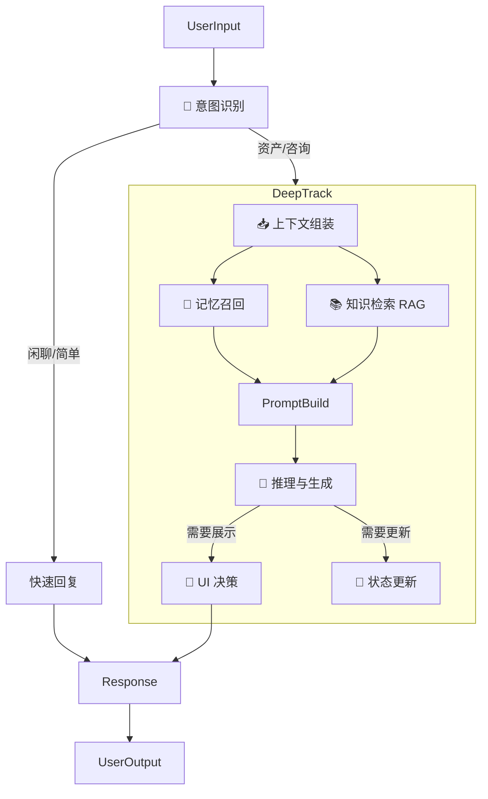

# AI 对话能力全链路优化方案

## 1. 目标与愿景

打造一个**"懂你、专业、有分寸"**的 AI 资产配置顾问。
- **懂你 (Fluency & Memory)**：记住你的家庭状况、财务细节，对话像老友一样流畅，不需要重复提供信息。
- **专业 (Knowledge & RAG)**：基于最新的房产政策和专业的财富管理方法论，提供有理有据的建议。
- **有分寸 (Adaptive UI)**：UI 卡片在合适的时候出现，辅助决策而不是打断对话。

## 2. 现状与差距分析 (Gap Analysis)

| 核心环节 | 当前现状 (As-Is) | 差距 (Gap) | 目标状态 (To-Be) |
| :--- | :--- | :--- | :--- |
| **意图理解** | 无显式意图分类，直接将所有消息丢给 LLM 处理。导致"闲聊"也可能触发复杂的后台逻辑。 | **盲目响应**：混淆了"闲聊"、"咨询"和"指令"，无法针对性调用工具。 | **精准分流**：引入意图识别层，区分资产录入、政策咨询、闲聊等，按需触发 RAG 或工具。 |
| **记忆系统** | 主要依赖短期上下文窗口。长期记忆 (L3 Vector) 有代码但未在对话流程中启用。 | **健忘**：无法利用之前的对话积累（如"我记得你上次提过想换房"），这也是"Stale Context"的根源之一。 | **全息记忆**：短期记忆维持流畅，长期记忆维持连贯，画像记忆维持个性化。 |
| **领域知识** | RAG 仅基于简单的关键词触发。知识库内容缺乏结构化（政策/产品/理财知识混杂）。 | **知识幻觉**：容易在用户未询问时输出不相关政策（如之前的北京限购案例），或在需要时给不出准确政策。 | **按需增强**：仅在需要专业知识时调用 RAG。构建分层的垂直知识库（政策库、产品库、专家规则库）。 |
| **交互体验** | UI 卡片（估值卡、图表）基于正则匹配关键词触发，非常激进。 | **打扰用户**：经常出现不需要的卡片（如提到"价值"就弹估值卡），或卡片数据与对话脱节。 | **克制交互**：由 AI 决定是否需要展示卡片。卡片是对话的自然延伸，而非生硬的打断。 |
| **资产落地** | 建议停留在"标准普尔占比"层面，缺乏可执行的 Asset Action。 | **纸上谈兵**：只有分析，没有行动路径。 | **行动导向**：结合 Action Plan，给出"置换"、"抵押"、"调整配置"的具体步骤。 |

---

## 3. 核心优化方案 (Core Optimization Strategy)

我们将对话处理流程从线性的 `Receive -> LLM -> Reply` 重构为基于**认知架构**的闭环系统。

### 3.1 架构升级：对话编排管线 (Pipeline)

重构 `ConversationOrchestrator`，引入以下阶段：

### 3.2 详细设计

#### A. 意图识别层 (Intent Layer)
在处理消息前，先判断用户的意图类型：
- **Types**:
  - `INFO_UPDATE`: 用户正在提供资产信息 ("我还有50万存款")
  - `POLICY_QUERY`: 政策咨询 ("北京二套房首付多少")
  - `ADVISORY`: 寻求建议 ("我该怎么理财")
  - `CHIT_CHAT`: 闲聊/确认 ("好的" / "谢谢")
- **Implementation**: 轻量级 LLM 调用或分类器，输出 JSON 包含 intent 和 confidence。

#### B. 记忆神经网络 (Memory System)
打通三层记忆：
1.  **L1 事实记忆 (Profile/Assets)**: 现有的 SQL 结构化数据。优化点：解决 Stale Context，确保实时性。
2.  **L2 短期记忆 (Conversation History)**: 当前 Session 的上下文。优化点：智能压缩，保留关键信息。
3.  **L3 长期记忆 (Vector Store)**: **重点建设**。
    - 存储：定期将对话摘要、用户偏好、关键生活事件向量化存入 Chroma/PGVector。
    - 召回：在构建 Prompt 时，根据当前 query 语义检索相关的历史记忆。
    - *例子*："用户问理财建议" -> 召回 "用户曾提到厌恶风险，且明年有购房计划" -> 生成 "稳健型且流动性好的建议"。

#### C. 立体化 RAG (Knowledge System)
不再是简单的关键词匹配，而是基于**意图**和**实体**的精确检索。
1.  **分层知识库**:
    - `PolicyDB`: 房产限购、贷款、税费（结构化强，地域关联）
    - `FinanceDB`: 理财方法论、产品百科
    - `ProductDB`: 具体的理财产品/贷款产品
2.  **检索策略**:
    - 当意图为 `POLICY_QUERY` 且包含地点实体（如"北京"）时，才检索 `PolicyDB`。
    - 避免在用户提供个人信息时检索无关政策。

#### D. 主动式 UI 交互 (Adaptive UI)
移出正则表达式硬编码触发，改为 **LLM 工具调用 (Tool Calling)**。
- 定义 UI 组件为 AI 可用的 Tools：`show_valuation_card`, `show_portfolio_chart`, `show_action_plan`。
- 在 Prompt 中描述每个卡片的适用场景。
- 由 AI 在生成回复时，决定是否调用工具来展示卡片。
- *优势*：AI 会根据上下文判断"现在该不该弹卡片"，而不是只要有关键词就弹。

---

## 4. 实施路线图 (Implementation Roadmap)

| 阶段 | 重点任务 | 预期成果 |
| :--- | :--- | :--- |
| **Phase 1: 大脑升级 (意图与记忆)** | 1. 实现 `IntentClassifier` 服务 2. 启用 `MemoryService` 向量检索并接入 `Orchestrator` 3. 重构 System Prompt，支持动态上下文注入 | AI 能区分闲聊和业务，能"记起"之前的偏好，回复更具个性化。 |
| **Phase 2: 知识扩容 (RAG 2.0)** | 1. 结构化房产政策库 (JSON/Markdown) 2. 升级 `RAGEngine`，支持基于意图的条件检索 3. 优化知识注入 Prompt，减少幻觉 | AI 能回答具体的房产政策问题，且只在被问到时回答，不再乱答。 |
| **Phase 3: 交互重构 (UI 工具化)** | 1. 废除正则匹配注入逻辑 2. 定义 UI Components 为 LLM Tools 3. 前端适配新的组件指令格式 | 卡片出现得恰到好处，不再打断对话，交互体验显著提升。 |
| **Phase 4: 行动落地 (Action Plan)** | 1. 引入 `ActionReasoner` 模块 2. 生成具体的行动清单 (Action Plan) 3. 联动 `ActionCard` 展示 | 从"聊聊天"变成"给方案"，真正具备顾问价值。 |

## 5. 关键技术点验证

- **Latency**: 引入意图识别和记忆检索会增加延迟，需使用并发执行 (`asyncio.gather`) 和流式预加载优化。
- **Token Usage**: 长期记忆和知识库会大幅增加 Prompt 长度，需引入 Token 预算管理，对上下文进行动态压缩。

此方案将作为系统重构的指导纲领，具体开发将按 Phase 分步进行。
