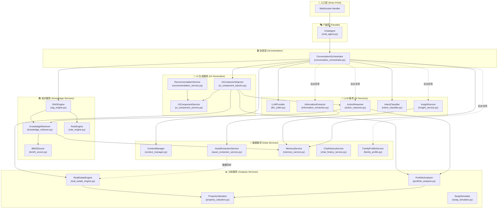
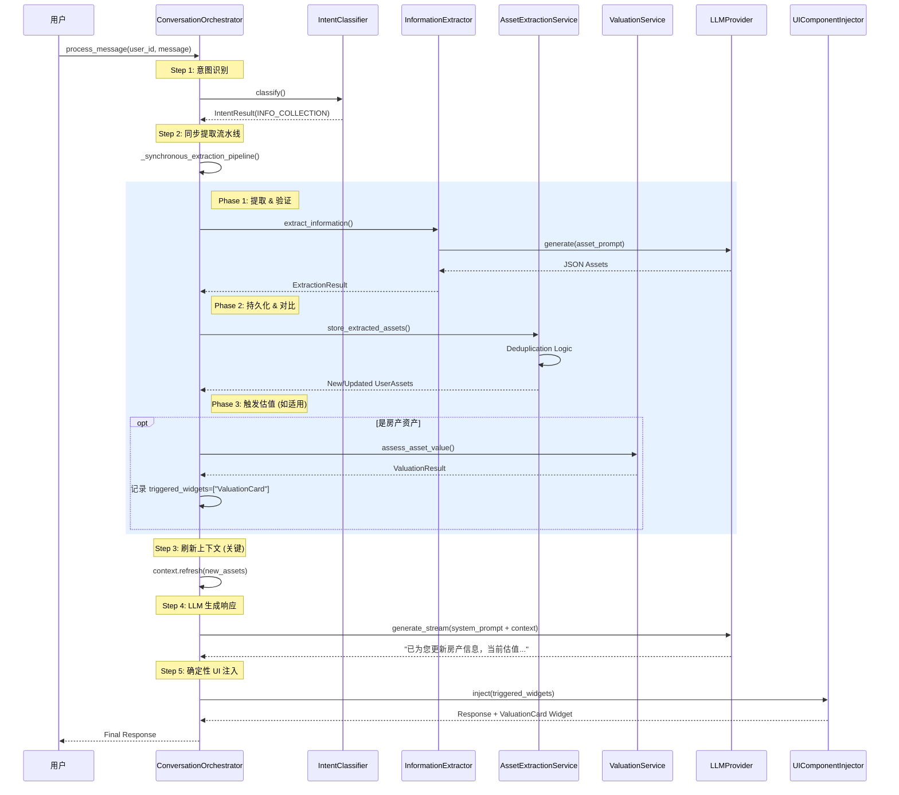
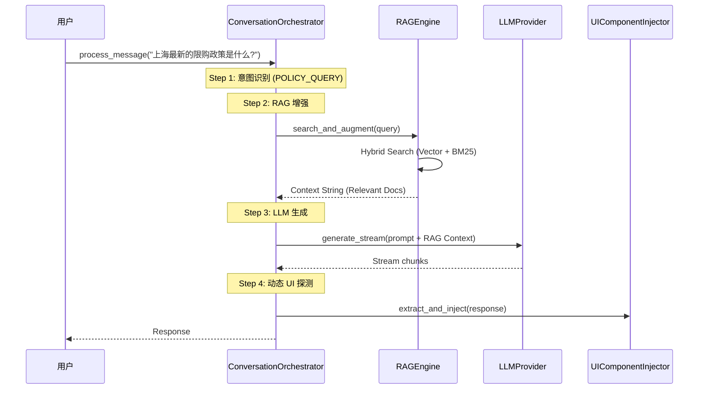

# AssetFlow 后端服务层架构分析文档

> 文档版本: 1.0  
> 分析目录: `backend/app/services/`  
> 服务文件数量: 31 个 Python 模块

---

## 1. 架构总览 (Architecture Overview)

### 核心职责

`backend/app/services/` 层是 AssetFlow 系统的**业务逻辑核心**，位于 API 层（Routers）与数据层（Models/Database）之间，负责**协调 LLM 调用、用户状态管理、信息提取、资产分析、UI 组件生成**等核心业务流程。

### 服务依赖图 (Mermaid Diagram)

---

## 2. 核心服务详解 (Detailed Analysis)

### 2.1 `conversation_orchestrator.py`

| 属性 | 描述 |
|------|------|
| **核心作用** | **中央协调器**，作为消息处理的主入口，负责协调 LLM 调用、意图分类、RAG 增强、UI 注入和后台任务触发 |
| **代码行数** | 1242 行 |

**关键方法 (Key Methods)**:

| 方法 | 作用 |
|------|------|
| `process_message()` | 主入口，处理用户消息流：意图分类 → RAG 增强 → LLM 生成 → UI 注入 → 后台提取 |
| `_background_extraction_pipeline()` | Fire-and-forget 后台流水线：信息提取 → 洞察分析 → 行动计划生成 → 家庭画像更新 |
| `_augment_with_rag()` | 根据用户意图调用 RAG 引擎增强 System Prompt |

**上下游关系**:
- **调用了谁**: `LLMProvider`, `ContextManager`, `UIComponentInjector`, `IntentClassifier`, `MemoryService`, `RAGEngine`, `InformationExtractor`, `InsightService`, `ActionReasoner`, `FamilyProfileService`
- **被谁调用**: `ChatAgent` (门面层)

**业务价值**: 解决了单体 ChatAgent 过于臃肿的问题，通过模块化设计实现了**职责分离**和**流程可控**。

---

### 2.2 `chat_agent.py`

| 属性 | 描述 |
|------|------|
| **核心作用** | **门面模式 (Facade)**，向外暴露统一的 `process_message()` 接口，内部委托给 `ConversationOrchestrator` |
| **代码行数** | 553 行 |

**关键方法 (Key Methods)**:

| 方法 | 作用 |
|------|------|
| `process_message()` | 对外统一入口，透传给 Orchestrator |
| `extract_ui_components()` | 向后兼容的 UI 组件提取方法 |

**上下游关系**:
- **调用了谁**: `ConversationOrchestrator`
- **被谁调用**: WebSocket Handler (API 层)

**业务价值**: 保持 API 兼容性，允许渐进式重构，同时保留 `ChatAgentLegacy` 作为降级方案。

---

### 2.3 `information_extraction.py`

| 属性 | 描述 |
|------|------|
| **核心作用** | **LLM 驱动的信息提取器**，从用户对话中结构化提取资产、画像和意图信息 |
| **代码行数** | 996 行 |

**关键方法 (Key Methods)**:

| 方法 | 作用 |
|------|------|
| `extract_information_from_conversation()` | 主方法，返回 (assets, user_profile, validation_result) |
| `_extract_assets()` | 使用 LLM 提取资产信息，支持标准普尔四象限分类 |
| `_fallback_extraction()` | LLM 不可用时的关键词匹配降级方案 |

**上下游关系**:
- **调用了谁**: `LLMProvider`
- **被谁调用**: `ConversationOrchestrator._trigger_information_extraction()`, `ConversationOrchestrator._synchronous_extraction_pipeline()`

**业务价值**: 解决了**非结构化对话到结构化数据**的转化问题，是用户资产图谱构建的核心。

---

### 2.4 `asset_extraction_service.py`

| 属性 | 描述 |
|------|------|
| **核心作用** | **数据持久化服务**，将提取的资产和画像信息存储到 L1/L2 数据层 |
| **代码行数** | 865 行 |

**关键方法 (Key Methods)**:

| 方法 | 作用 |
|------|------|
| `update_user_state()` | Phase 2 核心方法，同步更新资产、认知、画像三张表 |
| `store_extracted_assets()` | 写入 `UserAsset` 表，含去重逻辑 |
| `_find_similar_asset()` | 智能资产匹配，避免重复创建 |

**上下游关系**:
- **调用了谁**: SQLModel Session, `UserAsset`, `UserProfile`, `UserCognition` 模型
- **被谁调用**: `ConversationOrchestrator._trigger_information_extraction()`

**业务价值**: 解决了**资产数据的增量更新和去重**问题，保证数据一致性。

---

### 2.5 `portfolio_analyzer.py`

| 属性 | 描述 |
|------|------|
| **核心作用** | **资产配置分析引擎**，基于标准普尔四象限模型对用户资产组合进行诊断 |
| **代码行数** | 1055 行 |

**关键方法 (Key Methods)**:

| 方法 | 作用 |
|------|------|
| `analyze_portfolio()` | 主分析方法，返回 `PortfolioAnalysis` 对象 |
| `_classify_assets_by_quadrant()` | 将资产分类到四象限：要花的钱、保命的钱、生钱的钱、保本升值的钱 |
| `generate_analysis_summary()` | 生成可读的分析摘要 |

**上下游关系**:
- **调用了谁**: `PropertyValuation` (估值服务)
- **被谁调用**: `UIComponentInjector`, `ActionReasoner`, `RecommendationService`

**业务价值**: 解决了**一刀切的资产配置建议**问题，基于专业模型提供**个性化风险诊断**。

---

### 2.6 `ui_component_injector.py` + `ui_component_service.py`

| 属性 | 描述 |
|------|------|
| **核心作用** | **UI 组件生成服务**，根据上下文和工具调用生成前端可渲染的结构化组件 |
| **代码行数** | 591 行 + 593 行 |

**关键方法 (Key Methods)**:

| 方法 | 作用 |
|------|------|
| `extract_and_inject()` | 从响应中检测触发条件并注入 UI 组件 |
| `generate_widgets_from_tool()` | 根据 LLM Tool Call 生成具体组件数据 |
| `generate_valuation_card()` / `generate_portfolio_chart()` | 具体组件生成逻辑 |

**上下游关系**:
- **调用了谁**: `PortfolioAnalyzer`, `ActionReasoner`, `RealEstateEngine`, `UIComponentService`
- **被谁调用**: `ConversationOrchestrator`

**业务价值**: 实现了**对话式 UI 动态生成**，让 AI 响应包含可交互的卡片组件。

---

### 2.7 `action_reasoner.py`

| 属性 | 描述 |
|------|------|
| **核心作用** | **行动方案推理器**，基于用户资产和画像生成个性化的可执行行动计划 |
| **代码行数** | 800 行 |

**关键方法 (Key Methods)**:

| 方法 | 作用 |
|------|------|
| `generate_plan()` | 生成或检索行动方案，支持智能路由 (检查现存计划) |
| `analyze_gaps()` | 分析用户资产配置缺口 (保险、应急金、投资等) |
| `adopt_plan()` / `dismiss_plan()` | 计划生命周期管理 |

**上下游关系**:
- **调用了谁**: `PortfolioAnalyzer`, `KnowledgeRetriever`, `LLMProvider`
- **被谁调用**: `ConversationOrchestrator._trigger_action_plan_generation()`, `UIComponentInjector`

**业务价值**: 解决了**从分析到行动的转化**问题，提供可追踪、可采纳的具体步骤。

---

### 2.8 `insight_service.py`

| 属性 | 描述 |
|------|------|
| **核心作用** | **System 2 认知分析器**，从对话历史中提取用户心理画像和沟通策略 |
| **代码行数** | 682 行 |

**关键方法 (Key Methods)**:

| 方法 | 作用 |
|------|------|
| `analyze_user_psychology()` | 分析用户心理特征，更新 `UserCognition` 表 |
| `_extract_and_store_key_memories()` | 提取关键生活事件存入 L3 向量记忆 |
| `get_advisor_strategy()` | 获取当前的顾问沟通策略 |

**上下游关系**:
- **调用了谁**: `MemoryService`, `UserCognition` 模型
- **被谁调用**: `ConversationOrchestrator._trigger_insight_analysis()`

**业务价值**: 实现了**自适应对话策略**，让 AI 根据用户性格调整沟通方式。

---

### 2.9 `rag_engine.py` + `knowledge_retriever.py`

| 属性 | 描述 |
|------|------|
| **核心作用** | **知识增强检索引擎**，实现 Hybrid Search (向量 + BM25) 检索知识库 |
| **代码行数** | 253 行 + 431 行 |

**关键方法 (Key Methods)**:

| 方法 | 作用 |
|------|------|
| `RAGEngine.query()` | 执行 RAG 查询：检索知识 → 应用规则 → 构建 Prompt → 调用 LLM |
| `KnowledgeRetriever.search()` | 混合搜索：向量相似度 + BM25 关键词 |

**上下游关系**:
- **调用了谁**: `BM25Scorer`, `RuleEngine`, `MemoryService`
- **被谁调用**: `ConversationOrchestrator._augment_with_rag()`, `ActionReasoner`

**业务价值**: 解决了**LLM 知识局限性**问题，通过检索增强提供准确的政策和专业知识。

---

### 2.10 `context_manager.py`

| 属性 | 描述 |
|------|------|
| **核心作用** | **上下文生命周期与缓存管理**，负责用户会话上下文的加载、缓存 (Redis/Memory) 和更新 |
| **代码行数** | 506 行 |

**关键方法 (Key Methods)**:

| 方法 | 作用 |
|------|------|
| `get_context()` | 多级缓存获取上下文 (Memory -> Redis -> DB) |
| `get_fresh_context()` | **关键路径**: 强制从 DB 加载最新上下文，解决 "Stale Context" 问题 |
| `update_context()` | 更新上下文并处理缓存失效 |

**业务价值**: 解决了 LLM 对话中状态不一致的问题，确保 AI 总是基于最新的资产和画像进行回复。

---

### 2.11 `memory_service.py` (AI Powered 🧠)

| 属性 | 描述 |
|------|------|
| **核心作用** | **L3 长期记忆服务**，基于向量相似度检索非结构化历史信息 |
| **LLM/AI 调用** | **Local Embedding Model** (BAAI/bge-large-zh-v1.5) |
| **代码行数** | 346 行 |

**关键方法 (Key Methods)**:

| 方法 | 作用 |
|------|------|
| `retrieve_relevant()` | **Semantic Search**: 将 Query 转向量并检索最相似的记忆片段 |
| `add_memory()` | 将文本向量化存入 `pgvector` |
| `_generate_embedding()` | 调用本地 Transformer 模型生成 1024 维向量 |

**业务价值**: 让 AI 拥有"长期记忆"，能回想起用户很久前提到的细节，增强个性化体验。

---

### 2.12 `llm_caller.py` (LLM Core 🧠)

| 属性 | 描述 |
|------|------|
| **核心作用** | **LLM 调用抽象层**，封装底层模型调用，提供流式/非流式接口和 Mock 能力 |
| **LLM/AI 调用** | **Direct Call** (DeepSeek V3 / OpenAI) |
| **代码行数** | 362 行 |

**关键方法 (Key Methods)**:

| 方法 | 作用 |
|------|------|
| `generate_stream()` | 生成流式响应，自动过滤 `<Thought>` 思维链内容 |
| `generate()` | 生成完整响应，用于非交互式任务 (如信息提取) |
| `_filter_thought_blocks()` | 解析 DeepSeek R1 的思维链输出 |

**上游调用方 (Upstream Consumers)**:
1.  **`ConversationOrchestrator`**: 主对话生成 (Stream 模式)。
2.  **`IntentClassifier`**: 意图分类 (JSON 模式)。
3.  **`ActionReasoner`**: 行动方案生成与推理。
4.  **`RAGEngine`**: RAG 答案生成与改写。
5.  **`PropertyValuationService`**: 房产智能估值 (Tier 3)。
6.  **`InformationExtractor`**: 信息提取 (JSON 模式)。
7.  **`InsightService`**: 心理画像分析 (JSON 模式)。

**业务价值**: 实现了模型无关性，支持一键切换模型供应商，同时通过 Mock 模式加速本地开发。

---

### 2.13 `intent_classifier.py` (AI Powered 🧠)

| 属性 | 描述 |
|------|------|
| **核心作用** | **意图识别引擎**，决定用户消息的处理流程 |
| **LLM/AI 调用** | **Hybrid** (Regex Fast Path + LLM Smart Path) |
| **代码行数** | 150 行 |

**关键方法 (Key Methods)**:

| 方法 | 作用 |
|------|------|
| `classify()` | 主入口，优先 Fast Classify，失败则 Fallback 到 Smart Classify |
| `_smart_classify()` | **Call LLM**: 构造 Few-shot Prompt 让 LLM 判断复杂意图 |
| `_fast_classify()` | 关键词/正则快速匹配 (如 "生成报告" -> ACTION_REQUEST) |

**业务价值**: 降低 API 成本和延迟 (Fast Path)，同时保证复杂意图的准确率 (Smart Path)。

---

### 2.14 `family_profile.py`

| 属性 | 描述 |
|------|------|
| **核心作用** | **家庭图谱管理**，维护家庭成员关系及生命周期事件 |
| **代码行数** | 319 行 |

**关键方法 (Key Methods)**:

| 方法 | 作用 |
|------|------|
| `create_or_update_profile()` | 更新家庭财务概况和成员结构 |
| `add_lifecycle_event()` | 记录关键事件 (如"购房计划", "子女入学") |
| `extract_family_info_from_profile()` | 从非结构化画像中解析家庭结构 |

**业务价值**: 支持基于家庭生命周期的理财规划 (如教育金、养老金规划)。

---

### 2.15 `real_estate_engine.py`

| 属性 | 描述 |
|------|------|
| **核心作用** | **房产金融分析引擎**，计算房产的深层金融属性 |
| **代码行数** | 444 行 |

**关键方法 (Key Methods)**:

| 方法 | 作用 |
|------|------|
| `analyze_leverage_potential()` | 计算抵押率 (LTV) 和剩余融资空间 |
| `calculate_rental_yield()` | 计算租售比和租金回报率 |
| `_calculate_financial_score()` | 基于多维度数据给房产打分 (0-100) |

**业务价值**: 将"房子"转化为"资产"，揭示其流动性与金融价值。

---

### 2.16 `property_valuation.py` (AI Powered 🧠)

| 属性 | 描述 |
|------|------|
| **核心作用** | **多层级房产估值服务**，提供从精确到估算的房价数据 |
| **LLM/AI 调用** | **Tier 3 Fallback** (LLM 模糊估值) |
| **代码行数** | 571 行 |

**关键方法 (Key Methods)**:

| 方法 | 作用 |
|------|------|
| `get_market_value()` | 自动降级策略: API -> 本地基准 -> LLM -> 用户输入 |
| `LLMPropertyEstimator.estimate()` | **Call LLM**: 利用大模型常识估算特定小区的价格范围 |
| `CityBenchmarkData.estimate()` | 基于内置城市均价数据的静态估算 |

**业务价值**: 即使在缺乏精确数据的情况下，也能给出一个合理的参考与定锚价格。

---

### 2.17 `recommendation_service.py`

| 属性 | 描述 |
|------|------|
| **核心作用** | **商业化推荐引擎**，基于风险缺口推荐金融产品 |
| **代码行数** | 357 行 |

**关键方法 (Key Methods)**:

| 方法 | 作用 |
|------|------|
| `get_recommendations_for_risks()` | 根据 `PortfolioAnalyzer` 发现的风险点匹配产品 |
| `_map_risk_to_category()` | 将标准普尔四象限缺口映射到产品品类 (如"缺保障" -> "重疾险") |

**业务价值**: 系统的商业化变现核心，实现"咨询 -> 诊断 -> 解决方案"的闭环。

---

### 2.18 基础设施与工具服务

#### `rule_engine.py`
- **职责**: 管理业务规则 (如首付比例、限购政策)。
- **特点**: 将硬编码逻辑抽离为可配置规则，支持基于城市和时间的规则版本管理。

#### `bm25_scorer.py`
- **职责**: 实现 BM25 文本相关性算法。
- **特点**: 用于 RAG 的关键词检索部分，补充向量检索在精确匹配上的不足。

#### `chat_history_service.py`
- **职责**: 聊天记录的持久化存取。
- **特点**: 封装了 `ChatMessage` 的 CRUD 操作，支持按时间分页。

#### `search_tools.py`
- **职责**: **AI Tools** 集合，封装 Search API。
- **特点**: 提供给 LLM 调用的外部工具函数 (如 Search Web)。

#### `swap_simulator.py`
- **职责**: 房产置换计算器。
- **特点**: 模拟"卖一买一"的资金流，计算首付缺口和税务成本。

#### `sms_service.py`
- **职责**: 发送短信验证码。
- **特点**: 对接阿里云/腾讯云短信接口，开发环境下支持 Mock (回显到日志)。

#### `auth.py`
- **职责**: JWT 认证与 Token 管理。
- **特点**: 处理登录、Token 生成与校验、WebSocket 鉴权。

#### `audit.py`
- **职责**: 系统审计日志。
- **特点**: 记录关键业务操作 (如资产修改、敏感数据访问) 用于合规审查。

---

## 3. 关键业务流程 (Core Workflows)

### 3.1 资产信息收集流程 (Synchronous Extraction)
*适用于 `INFO_COLLECTION` 和 `ACTION_REQUEST` 意图*

> 用户输入: "我有一套500万的房产在上海，还有30万存款"

此流程采用了 **"Extract-First, Answer-Later" (先提取再回答)** 的模式，确保 LLM 生成回答时已经感知到最新的资产数据状态，并支持确定性的 UI 组件触发。

### 3.2 普通对话与 RAG 流程 (General Chat / RAG)
*适用于 `POLICY_QUERY`, `ADVISORY` 等意图*

### 数据流转详解

| 阶段 | 数据格式 | 存储位置 |
|------|----------|----------|
| 用户输入 | 自然语言文本 | - |
| 意图分类 | `IntentResult(type, confidence)` | 内存 |
| LLM 响应 | 流式文本 | `ChatMessage` 表 |
| 信息提取 | `ExtractedAsset`, `ExtractedUserProfile` | - |
| 数据持久化 | `UserAsset`, `UserProfile`, `UserCognition` | PostgreSQL |
| 上下文缓存 | `ConversationContext` | Redis / InMemory |
| 长期记忆 | `VectorMemory (embedding)` | PostgreSQL + pgvector |

---

## 4. 待优化项 (Optimization Suggestions)

### 4.1 架构层面

| 问题 | 描述 | 建议优化 |
|------|------|----------|
| **Orchestrator 体量过大** | `conversation_orchestrator.py` 达 1242 行，方法过多 | 考虑拆分为 `MessageProcessor` + `BackgroundPipeline` 两个类 |
| **循环依赖风险** | 多处使用 `from ... import` 在方法内部导入，说明存在潜在循环依赖 | 使用依赖注入容器或者 Protocol 接口解耦 |
| **同步/异步混用** | 部分服务方法是同步的 (`PortfolioAnalyzer`)，被异步调用时可能阻塞 | 统一使用 async 或在线程池中执行 CPU 密集任务 |

### 4.2 职责边界

| 问题 | 描述 | 建议优化 |
|------|------|----------|
| **UIComponentInjector 职责模糊** | 既负责检测触发条件，又负责调用分析服务生成数据 | 拆分为 `TriggerDetector` + `ComponentGenerator` |
| **InformationExtractor 过于庞大** | 996 行代码，包含提取、解析、验证、降级多种逻辑 | 拆分为 `AssetExtractor` + `ProfileExtractor` + `FallbackExtractor` |

### 4.3 可测试性

| 问题 | 描述 | 建议优化 |
|------|------|----------|
| **全局单例模式** | 大量 `get_xxx_service()` 全局单例，难以 mock | 使用 FastAPI 的 `Depends` 依赖注入 |
| **硬编码配置** | 部分阈值硬编码在代码中 (如 `trigger_threshold=5`) | 迁移到 `app.core.config` 统一管理 |

### 4.4 性能优化

| 问题 | 描述 | 建议优化 |
|------|------|----------|
| **后台任务无并发控制** | `_background_extraction_pipeline` 多个任务串行执行 | 使用 `asyncio.gather()` 并发执行独立任务 |
| **BGE Embedding 懒加载** | 首次调用 MemoryService 会阻塞加载模型 | 应用启动时预热加载 |

---

## 总结

AssetFlow 后端服务层采用了**协调器模式 (Orchestrator Pattern)** + **门面模式 (Facade Pattern)** 的设计，核心特点:

1. ✅ **职责分离清晰**: LLM 调用、数据提取、分析引擎、UI 生成各司其职
2. ✅ **Fire-and-Forget 后台处理**: 响应延迟与数据处理解耦
3. ✅ **多层缓存**: InMemory + Redis + Database 三级缓存
4. ✅ **Hybrid Search RAG**: 向量 + BM25 混合检索
5. ⚠️ **待改进**: 部分服务体量过大，存在潜在循环依赖

总体而言，架构设计合理，可扩展性良好，建议后续重点关注**服务粒度细化**和**依赖注入改造**。
