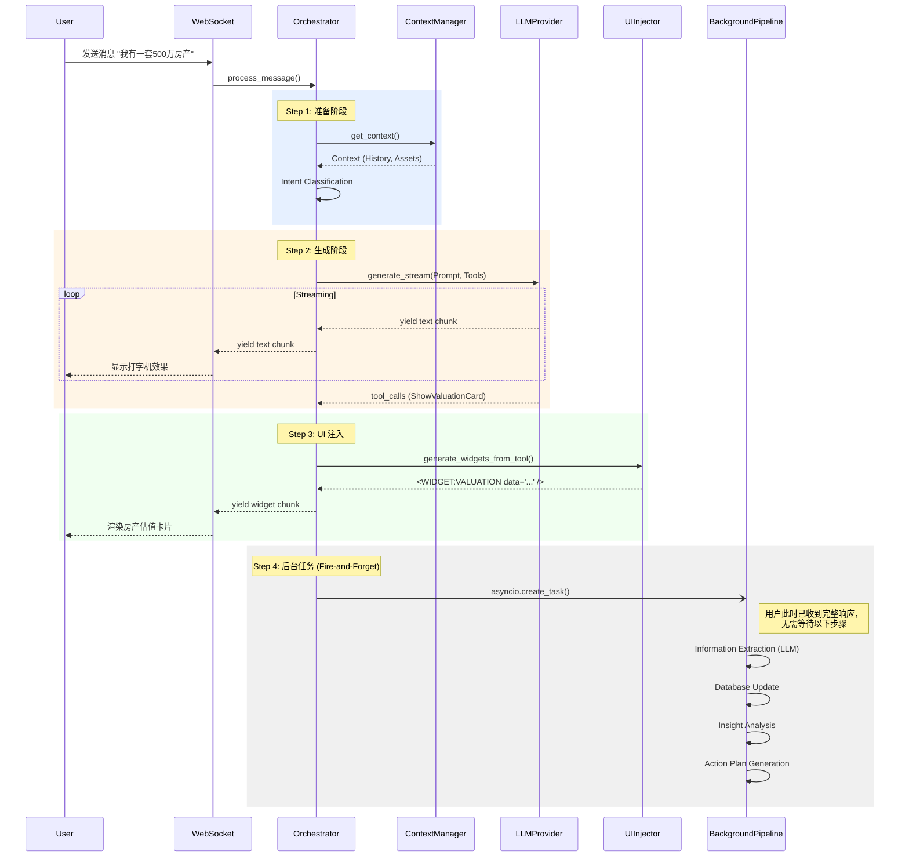

# Conversation Orchestrator 深度解析报告

> 文档目标: 深入分析 `backend/app/services/conversation_orchestrator.py` 的核心逻辑、设计模式与并发模型。
> 文件版本: 基于当前代码库最新版本 (1242 lines)

---

## 1. 核心业务流程 (The Workflow)

`process_message` 方法是 `ConversationOrchestrator` 的心脏，它将一次用户交互拆解为清晰的 **7 个步骤**。以下是完整的数据流转链路：

### Step 1: Context Loading & Intent Analysis

- **加载上下文**:
  - 调用 `ContextManager.get_context(user_id)` 获取 `ConversationContext` 对象。
  - 该对象包含：最近聊天记录、用户画像 (UserProfile)、资产列表 (UserAsset) 等。
  - **关键点**: 上下文加载是**异步**的，且支持多级缓存 (Memory/Redis/DB)，确保低延迟。
- **意图识别**:
  - 调用 `IntentClassifier.classify(message, history)`。
  - 识别用户意图 (如 `INFO_COLLECTION`, `POLICY_QUERY`, `ACTION_REQUEST`)。
  - **作用**: 意图决定了后续是否触发 RAG 检索 (仅 `POLICY_QUERY` 触发) 以及使用何种 System Prompt。

### Step 2: Prompt Construction & LLM Interaction

- **Prompt 构建**:
  - 基础 Prompt: 从 `agent_system.yaml` 加载。
  - **RAG 增强**: 如果意图匹配，调用 `_augment_with_rag` 检索知识库，并将知识片段注入 Prompt。
  - **记忆增强**: 调用 `MemoryService` 检索即时相关性最高的长期记忆 (Long-term Memory)。
  - **意图指令注入**: 根据意图类型注入特定的指导原则 (Intent Instructions)。
- **LLM 调用**:
  - 调用 `LLMProvider.generate_stream(messages, system_prompt, tools=ui_tools)`。
  - **流式响应**: 使用 `AsyncIterator` 逐块 (chunk) 返回文本，实现打字机效果。
  - **工具绑定**: 将 `ShowValuationCard` 等 UI 工具绑定到 LLM 上下文中。

### Step 3: Tool/UI Handling

- **工具捕获**:
  - 在流式生成过程中，编排器会监听 LLM 是否发出了 `tool_calls`。
  - 如果捕获到工具调用 (如 `ShowPortfolioChart`)，将暂存 `chunk`。
- **UI 组件生成**:
  - **策略 A (Tool-based)**: 优先使用 LLM 的 Tool Call。调用 `UIComponentInjector.generate_widgets_from_tool`，将工具参数转化为前端可渲染的 JSON 数据。
  - **策略 B (Fallback)**: 如果 LLM 未调用工具，但文本中隐含了 UI 需求，调用 `extract_and_inject` 使用正则/规则进行补救。
  - **注入方式**: 生成的 UI 组件以 `<WIDGET:TYPE data="..." />` 的形式追加到文本响应的末尾。

### Step 4: Background Tasks (Fire-and-Forget)

- **触发机制**:
  - 在响应生成的**最后一步** (返回给用户之后)，调用 `asyncio.create_task(self._background_extraction_pipeline(...))`。
  - **关键点**: 使用 `asyncio.create_task` 将任务提交到事件循环，**不等待**其完成，从而不阻塞用户的主交互流程。

---

## 2. 架构设计模式 (Design Patterns)

### 2.1 职责分离 (Decoupling)

对比传统的单体 `ChatAgent`，`ConversationOrchestrator` 实现了彻底的职责分离：

| 职责领域 | 负责组件 | 编排器 (Orchestrator) 的角色 |
|----------|----------|------------------------------|
| **状态管理** | `ContextManager` | 仅调用接口，不关心是查库还是查缓存 |
| **LLM 交互** | `LLMProvider` | 仅传入 Prompt，不关心是调 DeepSeek 还是 Mock |
| **信息提取** | `InformationExtractor` | 移至后台任务，不再阻塞主线程 |
| **UI 生成** | `UIComponentInjector` | 委托生成，仅负责拼接到响应中 |
| **知识检索** | `RAGEngine` | 根据意图按需调用 |

**优势**: 编排器只负责 "Coordination" (协调)，不再负责 "Implementation" (实现)，代码可读性和可维护性大幅提升。

### 2.2 依赖注入 (Dependency Injection)

在 `__init__` 方法中，核心服务通过参数传入或工厂方法获取，而不是在类内部硬编码实例化：

```python
def __init__(self, llm_provider: LLMProvider, context_manager: ContextManager):
    self.llm_provider = llm_provider
    self.context_manager = context_manager
    # ...
    # 部分服务使用工厂模式懒加载 (避免循环依赖)
    self.ui_injector = get_ui_component_injector()
    self.intent_classifier = get_intent_classifier()
```

**作用**:

- **可测试性**: 可以在单元测试中轻松注入 `MockLLMProvider` 或 `MockContextManager`。
- **灵活性**: 切换底层实现 (如从 DeepSeek 切到 GPT-4) 无需修改编排器代码。

---

## 3. 并发与性能 (Concurrency & Async)

### 3.1 异步流水线 (`_background_extraction_pipeline`)

这是系统性能优化的**核心黑科技**。该方法包含了一系列耗时的 "System 2" (慢思考) 任务：

1. **信息提取**: 调用 LLM 分析整段对话，提取资产/画像 (耗时约 2-3s)。
2. **知识图谱更新**: 将提取的数据写入 SQL 数据库。
3. **心理分析**: 分析用户性格和情绪 (耗时约 2s)。
4. **行动推演**: 生成 Action Plan (耗时约 3s)。
5. **记忆存储**: 生成 Embedding 并存入向量库。

### 3.2 "用户零感知" 实现原理

```python
# 代码片段 (lines 280-282)
asyncio.create_task(
    self._background_extraction_pipeline(message, user_id, context)
)
```

- **机制**: `asyncio.create_task` 将协程包装为 Task 并立即调度执行，但主协程 (`process_message`) **不使用 await 等待它**。
- **效果**:
  - 用户收到 "完整响应" 的时间 = LLM 生成时间 (流式)。
  - 后台任务在响应发送**后**默默执行。
  - 用户体验极其流畅，感觉不到后台正在进行复杂的推理和存储操作。

---

## 4. 可视化流程图 (Mermaid Diagram)



## 5. 方法详情与调用关系 (Method Details and Call Graph)

### 5.1 核心入口 (Core Entry Points)

#### `process_message`

- **用途**: 处理用户消息的主入口。严格遵循 7 步流水线（见第1节）：协调上下文加载、意图识别、RAG 检索、Prompt 构建、LLM 流式调用、UI 组件注入以及触发后台任务。
- **调用关系**:
  - **Called By**: API 路由层 (如 `Process Chat Message` endpoint).
  - **Calls**:
    - `ContextManager.get_context`
    - `IntentClassifier.classify`
    - `ChatHistoryService.save_user_message`
    - `_augment_with_rag`
    - `MemoryService.search_memories`
    - `_generate_plan_if_requested`
    - `_build_messages`
    - `_get_system_prompt`
    - `LLMProvider.generate_stream`
    - `UIComponentInjector.generate_widgets_from_tool` / `extract_and_inject`
    - `ChatHistoryService.save_ai_message`

    - `_background_extraction_pipeline` (via `asyncio.create_task`)

#### `get_conversation_orchestrator`

- **用途**: 获取或创建 `ConversationOrchestrator` 的单例实例。
- **调用关系**:
  - **Called By**: 依赖注入系统 (`app.core.dependencies`).
  - **Calls**: `__init__`.

### 5.2 提示词与上下文构建 (Prompt & Context Building)

#### `_build_messages`

- **用途**: 构建发送给 LLM 的消息列表。将系统信息（上下文摘要）、历史对话记录整合为标准消息格式。
- **调用关系**:
  - **Called By**: `process_message`.
  - **Calls**: `_build_context_summary`, `ConversationContext.get_recent_messages`.

#### `_build_context_summary`

- **用途**: 将复杂的用户上下文对象（画像、资产、房产）序列化为精炼的自然语言摘要，用于注入 Prompt 的首条 User Message 中，作为 Context Injection。
- **调用关系**:
  - **Called By**: `_build_messages`.
  - **Calls**: 无 (纯数据处理).

#### `_get_system_prompt`

- **用途**: 优先从 YAML 配置加载 System Prompt，失败时回退到默认 Prompt。
- **调用关系**:
  - **Called By**: `process_message`.
  - **Calls**: `prompt_manager.render`, `_get_default_system_prompt`.

#### `_get_default_system_prompt`

- **用途**: 提供硬编码的默认 System Prompt，作为配置加载失败的兜底。
- **调用关系**:
  - **Called By**: `_get_system_prompt`.

### 5.3 RAG 增强 (RAG Augmentation)

#### `_should_use_rag`

- **用途**: 启发式判断当前消息是否需要触发 RAG。基于关键词匹配（政策、房产、贷款等）和问题模式过滤，避免不必要的检索开销。
- **调用关系**:
  - **Called By**: `_augment_with_rag`.
  - **Calls**: 无.

#### `_augment_with_rag`

- **用途**: 执行 RAG 检索流程。调用 RAG 引擎查询知识库，并返回增强后的 System Prompt 和来源列表。
- **调用关系**:
  - **Called By**: `process_message`.
  - **Calls**: `_should_use_rag`, `RAGEngine.query`, `_build_rag_augmented_prompt`.

#### `_build_rag_augmented_prompt`

- **用途**: 将检索到的 `KnowledgeChunk` 和 `RuleConstraint` 格式化并注入到 System Prompt 模板中。
- **调用关系**:
  - **Called By**: `_augment_with_rag`.
  - **Calls**: `prompt_manager.render`.

### 5.4 计划与意图处理 (Planning & Intent)

#### `_generate_plan_if_requested`

- **用途**: 检测用户是否明确请求生成行动方案。如果是，则立即调用 ActionReasoner 生成方案，并返回引导性 Prompt 指令。这是为了实现“即问即答”的方案生成体验。
- **调用关系**:
  - **Called By**: `process_message`.
  - **Calls**: `ActionReasoner.generate_plan`.

### 5.5 后台流水线 (Background Pipeline)

#### `_background_extraction_pipeline`

- **用途**: 异步执行的后台任务总线。负责在响应发送后处理耗时操作，如信息提取、画像分析、数据同步等。
- **调用关系**:
  - **Called By**: `process_message` (via `asyncio.create_task`).
  - **Calls**: `_trigger_information_extraction`, `ContextManager.invalidate`, `_trigger_insight_analysis`, `_trigger_action_plan_generation`, `_trigger_real_estate_sync`, `_trigger_family_profile_update`.

#### `_trigger_information_extraction`

- **用途**: 调用 LLM (InformationExtractor) 从当次对话中提取用户资产和画像信息。
- **调用关系**:
  - **Called By**: `_background_extraction_pipeline`.
  - **Calls**: `extract_information` (LLM Service), `AssetExtractionService.update_user_state`, `_store_to_long_term_memory`.

#### `_trigger_insight_analysis`

- **用途**: 定期触发 System 2 的深度心理与风险偏好分析。
- **调用关系**:
  - **Called By**: `_background_extraction_pipeline`.
  - **Calls**: `InsightService.analyze_user_psychology`.

#### `_trigger_action_plan_generation`

- **用途**:（后台自动触发模式）在信息收集足够时，尝试主动生成行动方案。
- **调用关系**:
  - **Called By**: `_background_extraction_pipeline`.
  - **Calls**: `ActionReasoner.generate_plan`.

### 5.6 数据同步与持久化 (Sync & Persistence)

#### `_store_to_long_term_memory`

- **用途**: 将提取到的关键资产和画像变更存储到向量化长期记忆 (Vector Memory) 中。
- **调用关系**:
  - **Called By**: `_trigger_information_extraction`.
  - **Calls**: `MemoryService.add_memory`.

#### `_trigger_real_estate_sync`

- **用途**: 将提取到的通用资产数据同步到精细化的 `RealEstateAsset` 表中，处理房产与贷款的关联。
- **调用关系**:
  - **Called By**: `_background_extraction_pipeline`.
  - **Calls**: `_find_matching_property`.

#### `_trigger_family_profile_update`

- **用途**: 根据提取的画像信息更新家庭成员图谱 (FamilyProfile)。
- **调用关系**:
  - **Called By**: `_background_extraction_pipeline`.
  - **Calls**: `FamilyProfileService.extract_family_info_from_profile`, `FamilyProfileService.create_or_update_profile`.

### 5.7 工具方法 (Utilities)

#### `_find_matching_property`

- **用途**: 使用模糊匹配算法（地点、名称、面积）在现有房产列表中查找匹配项，用于数据同步去重。
- **调用关系**:
  - **Called By**: `_trigger_real_estate_sync`.
  - **Calls**: `_is_name_similar`.

#### `_is_name_similar`

- **用途**: 计算两个字符串的 Jaccard 相似度，用于模糊名称匹配。
- **调用关系**:
  - **Called By**: `_find_matching_property`.

## 6. 优化建议 (Optimization Suggestions)

基于当前架构分析，提出以下优化建议以进一步提升系统的健壮性和可维护性：

### 6.1 并发控制 (Concurrency Control)

当前使用 `asyncio.create_task` 触发后台任务，在高并发场景下可能会导致无限创建 Task，耗尽系统资源。

- **建议**: 引入 `asyncio.Semaphore` 或使用 `TaskGroup` (Python 3.11+) 来限制并发执行的后台任务数量。或者引入消息队列 (如 Celery/RabbitMQ) 将后台任务完全解耦，确保主服务的稳定性。

### 6.2 错误处理粒度 (Granular Error Handling)

`process_message` 中的 `try-except` 覆盖范围过大。

- **建议**: 对 RAG 检索、LLM 调用、UI 生成等关键步骤进行细粒度的错误捕获。例如，如果 RAG 检索失败，应仅降级为普通对话，而不是中断整个处理流程或返回通用错误信息。

### 6.3 状态管理安全性 (State Safety)

`ConversationContext` 对象在异步流程中被传递和修改。

- **建议**: 考虑将 Context 设计为不可变对象 (Immutable)，每次更新返回新实例，或者在并发修改敏感区域加锁，避免潜在的竞态条件 (Race Conditions)。

### 6.4 可观测性 (Observability)

当前的日志记录较详细，但在分布式链路追踪方面有所欠缺。

- **建议**: 引入 OpenTelemetry 或类似工具，为 `process_message` -> `LLM` -> `Background Task` 的全链路添加 Trace ID，便于跨组件追踪请求的处理延时和故障定位。
