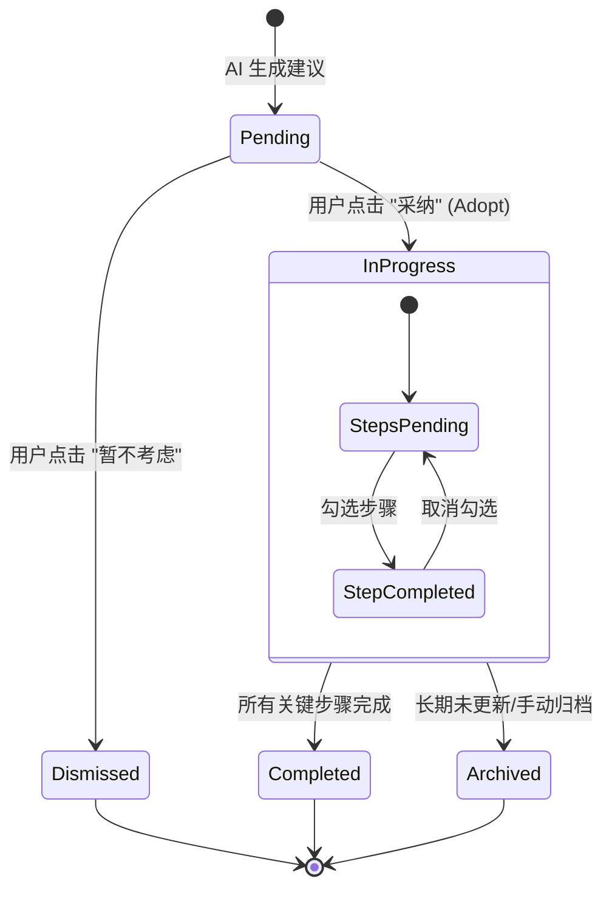

# ActionPlan 系统详细需求文档

## 1. 核心定位
ActionPlan 是系统的核心交付物，用于将 AI 的理财建议转化为可执行、可追踪的具体步骤。它不仅仅是一段文本建议，而是一个具有完整生命周期的结构化数据对象。

## 2. 业务需求

### 2.1 核心分类 (Five Pillars)
为了保持系统的聚焦，所有的 ActionPlan 必须归属于以下五大核心分类之一：
1.  **资产增值 (Wealth Growth)**: 投资组合、理财产品购买等。
2.  **财富保障 (Wealth Protection)**: 保险配置、应急基金等。
3.  **债务优化 (Debt Optimization)**: 还款计划、利率优化等。
4.  **房产规划 (Real Estate)**: 购房准备、房贷管理等。
5.  **生活规划 (Life Planning)**: 退休规划、教育金储备等。

### 2.2 生命周期管理 (Lifecycle)
ActionPlan 具有明确的状态流转：
-   **Pending (待采纳)**: AI 生成后的初始状态，用户尚未确认。此时仅仅是一个"建议"。
-   **In Progress (执行中)**: 用户点击"采取行动" (Adopt) 后，计划进入活跃状态。系统开始追踪具体的步骤进度。
-   **Completed (已完成)**: 所有步骤勾选完成，或用户手动标记完成。
-   **Dismissed (已忽略)**: 用户明确表示不感兴趣或暂不执行。
-   **Archived (已归档)**: 历史久远或不再相关的计划。



### 2.3 智能路由与冲突解决 (Smart Routing Logic)

系统通过 `ActionReasoner` 和 `Orchestrator` 协同工作，确保用户不会被重复生成的方案困扰。

#### A. 路由核心规则
系统遵循 **"One Active Plan per Category"** (单分类单活跃计划) 原则：
1.  **分类隔离**: "资产增值"类的计划不会阻塞"财富保障"类的计划生成。
2.  **活跃状态定义**:
    *   `in_progress`: 用户已采纳并正在执行。 **(强阻塞)**
    *   `pending`: AI已生成但用户未表态。 **(弱阻塞)**

#### B. 智能过期策略 (The 7-Day Rule)
为了防止用户被过时的"待采纳"计划卡住，系统实施以下过期逻辑：
*   **检查对象**: 仅针对 `pending` 状态的计划。
*   **规则**: 如果一个 `pending` 计划创建时间超过 **7天**，系统将其视为"失效 (Stale)"。
*   **行为**: 失效计划**不**也会阻塞新计划的生成。系统会直接忽略它并生成全新的方案。
*   *代码实现参考: `action_reasoner.py -> get_active_plan_by_category`*

#### C. 冲突处理流程
当用户请求生成方案，且该分类下存在有效的活跃计划时：

1.  **用户意图识别 (Orchestrator)**:
    *   检测到关键词（如"生成方案"）。
    *   同时检测是否存在**强制意图**（如"重新生成"、"覆盖"）。
    *   如果是"强制意图"，则跳过路由检查，直接生成新计划（并自动归档旧计划）。

2.  **冲突响应**:
    *   如果非强制请求且存在活跃计划，后端返回 `existing_active` 或 `existing_pending` 状态。
    *   **LLM 话术调整**: 系统会向 LLM 注入指令，要求其回复："检测到您已有一份正在进行的同类方案..."，并引导用户查看现有卡片。

```mermaid
flowchart TD
    Start[User Request] --> Intent{Intent Analysis}
    Intent -->|Force New/Regenerate| Generate[Generate New Plan]
    Intent -->|Standard Request| CheckDB[Check DB for Active Plan]
    
    CheckDB -->|No Plan Found| Generate
    CheckDB -->|Found 'In Progress'| Conflict[Return Conflict Signal]
    CheckDB -->|Found 'Pending'| TimeCheck{Created > 7 Days?}
    
    TimeCheck -->|Yes (Stale)| Generate
    TimeCheck -->|No (Fresh)| Conflict
    
    Conflict --> Response[Agent Asks: View or Regenerate?]
    Generate --> Card[Show New ActionPlanCard]
```

## 3. 功能需求

### 3.1 生成与展示
-   **结构化生成**: AI 输出必须符合严格的 JSON Schema，包含 `title`, `summary`, `steps` (数组), `priority`, `benefits`, `risks` 等字段。
-   **置信度标注**: 每个计划需附带 AI 的置信度评分 (Confidence Score)。
-   **多维度筛选**: 用户可以按分类、状态、优先级筛选计划列表。

### 3.2 交互流程
1.  **会话触发**: 用户在对话中表达需求，Orchestrator 识别意图并调用 ActionReasoner。
2.  **卡片展示**: 对话流中展示 `ActionPlanCard`，包含摘要和预览。
3.  **详情查看**: 点击展开或跳转详情页，查看具体步骤、收益和风险。
4.  **采纳 (Adopt)**: 用户点击"立即采纳"，计划状态变更为 `in_progress`，并加入到用户的任务清单。
5.  **执行跟踪**: 用户可以在详情页或列表中勾选具体的步骤 (Step)，系统记录步骤完成状态。

### 3.3 数据统计
-   提供仪表盘视图，展示当前进行中、已完成、待处理的计划数量统计。

## 4. 数据模型设计

### ActionPlan
-   `id`: unique identifier
-   `user_id`: owner
-   `title`: short descriptive title
-   `summary`: detailed explanation
-   `category`: enum (WealthGrowth, etc.)
-   `status`: enum (pending, in_progress, etc.)
-   `priority`: high/medium/low
-   `confidence`: float (0.0 - 1.0)
-   `created_at`, `updated_at`

### ActionPlanStep
-   `id`
-   `plan_id`: foreign key
-   `step_number`: sequence order
-   `action`: description of the step
-   `status`: pending/completed
-   `is_optional`: boolean
-   `timeline`: estimated time/deadline

## 5. API 接口规范
-   `GET /api/v1/plans`: 获取计划列表 (支持 status/category 过滤)
-   `GET /api/v1/plans/{id}`: 获取单个计划详情
-   `POST /api/v1/plans/{id}/adopt`: 采纳计划
-   `POST /api/v1/plans/{id}/dismiss`: 忽略计划
-   `PATCH /api/v1/plans/{plan_id}/steps/{step_id}`: 更新步骤状态

## 6. 未来规划 (Future Roadmap)

以下功能建议已记录归档，作为后续版本的需求输入：

### 6.1 灵活的路由策略
- **现状**: 严格的 "Single Active Plan per Category" 限制了多目标场景。
- **规划**: 引入 `Topic` 或 `Goal` 维度，允许同类目下并行存在针对不同目标的计划（如"股票调仓"与"教育金定投"并存）。

### 6.2 用户自主权 (User Agency)
- **现状**: 用户只能全盘采纳或忽略。
- **规划**: 支持用户编辑 `Pending` 或 `In Progress` 计划，允许增删改具体步骤 (Add/Edit/Delete Steps)，使 Action Plan 成为真正的个性化任务清单。

### 6.3 细化的反馈机制
- **现状**: 忽略 (Dismiss) 仅记录状态，丢失原因。
- **规划**: 增加 Dismiss 原因采集（如"资金不足"、"风险太高"），并将反馈回写至 Memory，用于优化模型未来的推荐逻辑。

### 6.4 动态有效期
- **现状**: 硬编码的 7 天过期规则。
- **规划**: 引入 `valid_until` 字段，由 AI 根据建议的时效性（如市场操作 vs 保险配置）动态设定有效期。

### 6.5 主动触达 (Push Notifications)
- **现状**: 被动查看。
- **规划**: 增加基于截止日期的提醒机制，主动推送待办事项，提升用户执行率。
