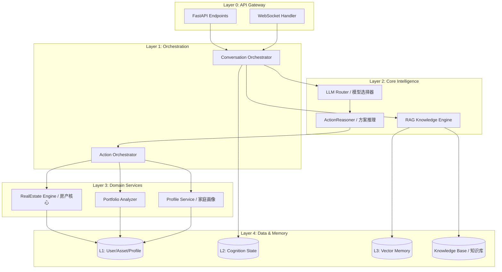

# AssetFlow 后端系统重构框架与实施计划

> **文档目的**: 基于 `backend_business_flow.md` 中的分析 (Section 4 & 5)，对分析结论进行验证和补充，并提出系统重构框架与详细实施计划。

## 1. 分析验证与补充 (Analysis Validation & Supplement)

### 1.1. Section 4 (现有问题分析) 评估

**评估结论：准确，但可补充。**

*   **4.1 架构与设计**: ✅ **准确**。`ChatAgent` 确实是一个职责过重的"上帝类"，Mock 逻辑混杂问题也真实存在。
*   **4.2 数据一致性**: ✅ **准确**。`flag_modified` 的使用证实了 JSON 字段的 ORM 追踪问题。
*   **4.3 实现细节**: ✅ **准确**。模糊匹配和 JSON 解析脆弱性问题确实存在。

**补充发现 (Additional Findings):**

1.  **`RecommendationService` 与业务深度脱节**:
    *   当前 `RecommendationService` 仅是简单的 "Risk Type -> Product Category" 映射。
    *   缺少动态的、基于用户画像和资产结构的**个性化推荐算法**。
    *   与"买方投顾"定位不符，更像是"广告匹配器"。

2.  **`MemoryService` (L3 Vector Memory) 未被充分利用**:
    *   虽然有独立的 `MemoryService`，但其 `retrieve_relevant` 方法 (RAG 检索) 在 `ChatAgent` 中**未被调用**。
    *   向量记忆功能形同虚设，AI 对话无法真正利用长期记忆进行上下文增强。

3.  **数据模型过于扁平**:
    *   `UserProfile` 模型过于简单 (仅 6 个字段)，无法表达"家庭"这一复杂实体。
    *   `UserAsset` 模型的 `extra_data` JSON 字段承载了过多非结构化信息 (位置、面积、贷款等)，缺乏对"房产金融属性"的一等建模。

4.  **商业产品模型 (`CommercialProduct`) 与核心业务隔离**:
    *   商业推荐逻辑与核心资产分析逻辑是两条独立的流水线。
    *   未实现"买方投顾"所需的"产品与用户资产的联动推演"。

### 1.2. Section 5 (业务需求与实现差距分析) 评估

**评估结论：核心观点精准，是重构的关键方向。**

*   **5.1 房产锚点缺失**: ✅ **完全正确**。代码中房产被视为"减持对象"而非"配置核心"。
*   **5.2 Vertical AI 深度不足**: ✅ **完全正确**。无 RAG 知识库，无领域专家规则。
*   **5.3 专属体验割裂**: ✅ **完全正确**。Stale Context 和粗糙画像是主因。
*   **5.4 买方投顾行动力不足**: ✅ **完全正确**。建议是"比例调整"而非"可执行方案"。

---

## 2. 系统重构框架 (System Architecture Framework)

基于上述分析，提出以下目标架构：



### 2.1. 核心架构升级点

| 领域 | 当前架构 | 目标架构 |
| :--- | :--- | :--- |
| **会话编排** | `ChatAgent` 单体控制 | `ConversationOrchestrator` + `ActionOrchestrator` 分离 |
| **知识增强** | 无 | `RAGKnowledgeEngine` (政策库 + 房产数据库 + 产品库) |
| **房产核心** | 作为普通资产 | `RealEstateEngine` 独立服务 (金融属性建模) |
| **方案推理** | 比例建议 | `ActionReasoner` (可执行方案生成器) |
| **画像系统** | 扁平 `UserProfile` | `ProfileService` (家庭图谱 + 生命周期) |
| **记忆系统** | L3 未使用 | L1/L2/L3 联动，RAG 主动召回 |

---

## 3. 详细实施计划 (Detailed Implementation Plan)

### Phase 1: 架构解耦与基础夯实 (4 周)

**目标**: 消除技术债务，为后续能力升级打基础。

| Week | 任务 | 产出物 |
| :--- | :--- | :--- |
| **W1** | 拆解 `ChatAgent` 为 `ConversationOrchestrator` + `LLMCaller` + `UIComponentInjector` | 3 个独立模块 |
| **W1** | 抽象 `LLMProvider` 接口，Mock 逻辑移至 `MockLLMProvider` 实现 | LLM 接口层 |
| **W2** | 实现 `ContextManager` 替代 Plan E workaround，使用 Redis 缓存 + 主动失效策略 | 解决 Stale Context |
| **W2** | JSON 字段改用 PostgreSQL JSONB 并添加 GIN 索引 | ORM 追踪稳定 |
| **W3** | 重构 `AssetExtractionService` 的模糊匹配为数据库层 `trigram` 或 `pg_trgm` | 匹配效率提升 |
| **W3** | 增强 JSON 输出解析层，增加 `pydantic` Structured Output 校验 | LLM 输出稳定性 |
| **W4** | 添加核心服务单元测试 (pytest) 覆盖率 > 70% | 测试套件 |
| **W4** | 重构 `RecommendationService` 接口，引入依赖注入 | 服务解耦 |

### Phase 2: 房产核心引擎 (3 周)

**目标**: 构建"以房产为锚点"的核心能力。

| Week | 任务 | 产出物 |
| :--- | :--- | :--- |
| **W5** | 设计 `RealEstateAsset` 一等数据模型 (抵押潜力、租售比、贷款信息) | 数据模型 |
| **W5** | 实现 `RealEstateEngine.analyze_financial_leverage()` 方法 | 房产金融分析 |
| **W6** | 集成外部房产数据 API (e.g., 贝壳/链家估值) | 房价数据源 |
| **W6** | 实现 `PropertySwapSimulator` (房产置换推演) | 模拟器模块 |
| **W7** | 重构 `PortfolioAnalyzer`，房产从"保本升值"独立为"核心锚点"象限 | 分析逻辑升级 |
| **W7** | 修改风险预警规则：房产集中不再是"风险"，而是"运用策略起点" | 规则引擎调整 |

### Phase 3: RAG 知识库与垂直 AI (4 周)

**目标**: 建立真正的 Vertical AI 壁垒。

| Week | 任务 | 产出物 |
| :--- | :--- | :--- |
| **W8** | 设计 `KnowledgeBase` Schema (政策类/房产类/产品类) | 知识库结构 |
| **W8** | 实现 `DocumentIngestion` 管道 (爬虫/人工录入 -> 向量化) | 数据入库流程 |
| **W9** | 实现 `RAGKnowledgeEngine.retrieve()` 与 `rerank()` | RAG 核心能力 |
| **W9** | 集成 `MemoryService.retrieve_relevant()` 到 `ConversationOrchestrator` | 长期记忆激活 |
| **W10** | 构建专家规则引擎 (基于政策/法规的硬约束) | Rule Engine |
| **W10** | 实现 Hybrid Search (Keyword + Vector + BM25) | 搜索质量提升 |
| **W11** | 录入首批知识数据 (20 条政策 + 100 条房产 FAQ + 50 条产品) | 初始知识库 |
| **W11** | A/B 测试 RAG vs. Pure LLM 回答质量 | 效果验证 |

### Phase 4: 可执行方案与用户体验 (3 周)

**目标**: 让 AI 给出"可落地"的买方投顾建议。

| Week | 任务 | 产出物 |
| :--- | :--- | :--- |
| **W12** | 设计 `ActionPlan` 数据模型 (步骤/预期收益/风险) | 方案结构 |
| **W12** | 实现 `ActionReasoner.generate_plan()` (基于资产+画像+知识库推理) | 方案生成器 |
| **W13** | 实现 `FamilyProfileService` (家庭成员图谱 + 生命周期事件) | 画像升级 |
| **W13** | 重构 UI 组件：增加 `ActionPlanCard` 组件 | 前端协同 |
| **W14** | 端到端体验优化：减少"废话建议"，增加"下一步"引导 | UX 提升 |
| **W14** | 用户测试 & 反馈收集 | 用户验证 |

---

## 3.5. 增量交付与验收原则 (Incremental Delivery & Validation)

> **核心原则**: 每个 Phase 结束后，系统必须保持**完整可运行**状态（前后端均可启动），并可进行功能验收。

### Phase-by-Phase 验收检查点

| Phase | 系统可运行性 | 验收标准 |
| :--- | :--- | :--- |
| **Phase 1** | ✅ **完全兼容** | 重构是内部解耦，对外 API 保持不变。前后端启动无变化，现有功能回归测试通过。 |
| **Phase 2** | ✅ **增量扩展** | 新增 `RealEstateEngine` 是可选调用路径。原有 `PortfolioAnalyzer` 逻辑保留，新引擎通过 Feature Flag 启用。 |
| **Phase 3** | ✅ **渐进激活** | RAG 知识库初期为空也不影响系统运行。知识召回逻辑设计为"有则增强，无则降级"。 |
| **Phase 4** | ✅ **增量 UI** | 新增 `ActionPlanCard` 组件与现有组件并存。前端通过组件类型判断渲染，无破坏性变更。 |

### 每阶段验收清单模板

```markdown
## Phase X 验收清单

### 1. 系统启动验证
- [ ] 后端服务启动成功 (`uvicorn main:app`)
- [ ] 前端服务启动成功 (`flutter run` / `npm run dev`)
- [ ] 数据库迁移无报错 (`alembic upgrade head`)

### 2. 回归测试
- [ ] 核心 API 端点响应正常 (GET /assets, POST /chat, etc.)
- [ ] WebSocket 连接与消息收发正常
- [ ] 单元测试通过率 ≥ 上一阶段

### 3. 新功能验证
- [ ] 本阶段新增功能可演示
- [ ] Feature Flag 开关验证 (开/关均不影响系统稳定性)

### 4. 性能基线
- [ ] API 响应时间无显著劣化 (P95 < 500ms)
- [ ] 内存占用无异常增长
```

### 技术保障措施

1.  **Feature Flag 策略**: 所有新能力默认关闭，通过配置逐步启用。
2.  **Strangler Fig Pattern**: 新模块与旧模块并行运行，逐步迁移流量。
3.  **数据库向后兼容**: 仅新增字段/表，不删除或修改现有结构（直到稳定后统一清理）。
4.  **Shadow Mode Testing**: 新引擎可在后台运行并记录结果，但不影响实际返回。

---

## 4. 风险与缓解 (Risks & Mitigation)

| 风险 | 概率 | 影响 | 缓解措施 |
| :--- | :--- | :--- | :--- |
| 外部房产数据 API 访问受限 | 中 | 高 | 准备多数据源 fallback，支持用户手动输入 |
| RAG 知识库构建耗时超预期 | 中 | 中 | 优先录入高频问题，采用增量扩充策略 |
| LLM 成本增加 (RAG 增加 token) | 低 | 中 | 实现 Prompt 压缩，使用缓存降低重复调用 |
| 用户对"房产锚点"概念不理解 | 低 | 中 | 增加引导性对话，渐进式教育用户 |

---

## 5. 成功指标 (Success Metrics)

| 指标 | 当前基线 | Phase 1 目标 | Phase 4 目标 |
| :--- | :--- | :--- | :--- |
| **对话连贯性** (用户无需重复信息) | ~60% | 85% | 95% |
| **房产相关问题解答准确率** | ~50% | 70% | 90% |
| **可执行建议比例** | ~10% | 30% | 70% |
| **用户满意度 (NPS)** | N/A | +20 | +50 |
| **单元测试覆盖率** | ~20% | 70% | 80% |

---

## 附录: 关键文件变更预览

| 文件/模块 | 变更类型 | 说明 |
| :--- | :--- | :--- |
| `services/chat_agent.py` | **重构 (拆分)** | 拆分为 3+ 模块 |
| `services/real_estate_engine.py` | **新增** | 房产核心引擎 |
| `services/rag_engine.py` | **新增** | RAG 知识引擎 |
| `services/action_reasoner.py` | **新增** | 方案推理器 |
| `services/context_manager.py` | **新增** | 上下文管理 (替代 Plan E) |
| `models/user.py` | **修改** | 拆分房产模型 |
| `models/family.py` | **新增** | 家庭图谱模型 |
| `models/knowledge.py` | **新增** | 知识库模型 |

